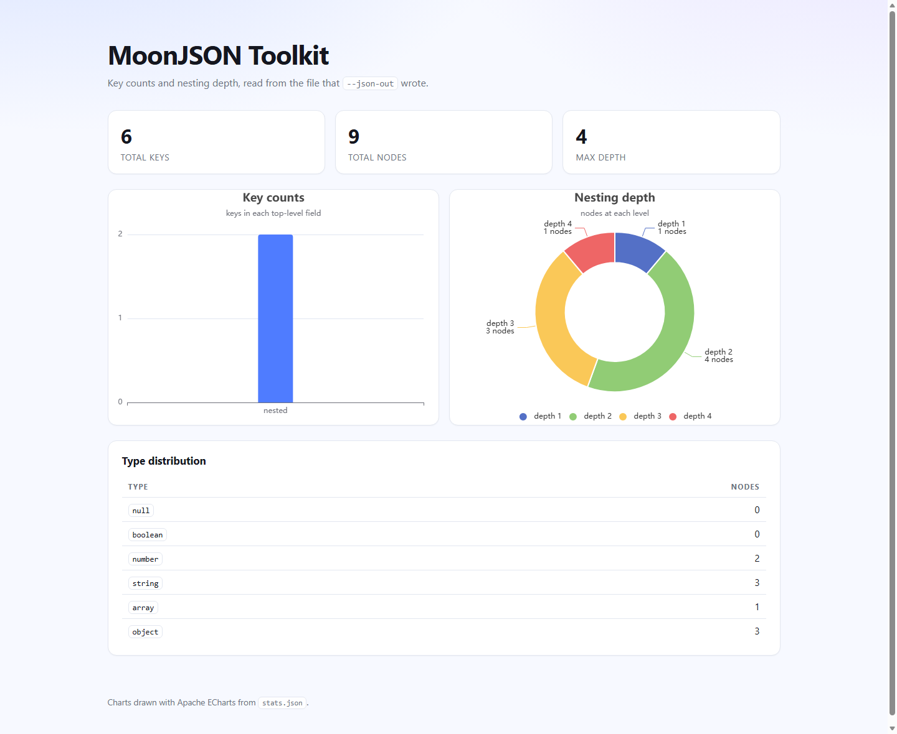

# MoonJSON Toolkit

A JSON toolkit for MoonBit: format, validate, diagnose, analyse and visualise
JSON documents. It ships as a command line tool plus a small web dashboard that
charts the statistics the tool writes.



## Features

- **Formatting** — pretty-prints any JSON document with 0 to 16 spaces per
  nesting level. Empty containers stay inline, strings are escaped correctly,
  and numbers keep the exact literal they had in the input.
- **Validation with diagnostics** — a malformed document reports the line, the
  column and the reason, and points at the offending character:

  ```
  error: <stdin> is not valid JSON
  line 1, column 8: expected opening quote
    {"a":1,}
           ^
  ```

- **Statistics** — key counts, node counts, maximum nesting depth, the
  distribution of JSON types and a per-depth breakdown, written as JSON.
- **Charts** — a [Rabbita](https://github.com/moonbit-community/rabbita) web app
  renders the statistics file as a key-count bar chart, a nesting-depth pie
  chart and a type table.
- **AI review** — `--ai` sends the formatted document to DeepSeek and prints a
  quality report with refactoring suggestions.

## Requirements

- The [MoonBit toolchain](https://www.moonbitlang.com/download/) (developed
  against `moon 0.1.20260915`).
- A native target. The HTTP client and the async runtime are native only, so the
  command line tool builds for `native` rather than `wasm`.

## Installation

```sh
git clone https://github.com/BigSaltyMan/moonjson-toolkit.git
cd moonjson-toolkit
moon build --target native
```

Dependencies are declared in `moon.mod` and fetched by `moon build`:

```sh
moon add Nanaloveyuki/parsec   # parser combinators, with a JSON grammar
moon add oboard/mio            # HTTP client used by --ai
```

## Usage

```
moonjson-toolkit - format, validate and analyse JSON documents

Usage:
  moonjson-toolkit [options]

Input is read from standard input unless --file is given.

Options:
  -f, --file <path>      Read JSON from <path> instead of standard input
  -i, --indent <n>       Spaces per nesting level, 0 to 16 (default: 2)
  -v, --validate         Only check the input and report the first error
  -h, --help             Show this message and exit
  -V, --version          Show the version and exit
      --ai               Ask DeepSeek for a quality report and suggestions
      --json-out <path>  Write a statistics report as JSON to <path>
```

Short options may be combined, so `-vh` means `-v -h`. The value of `--indent`
may be attached, as in `-i4`, `-i=4`, `--indent=4` or `--indent 4`.

Note that `-v` and `-V` are different flags: the lower case one validates, the
upper case one prints the version.

`-v` replaces the formatted document with a one-line verdict. It is the only
thing it changes: `--json-out` and `--ai` still run. `--help` and `--version`
both answer without reading any input at all.

### Exit codes

| Code | Meaning |
| ---- | ------- |
| `0`  | the input was formatted, or validated successfully |
| `1`  | the input could not be read, or is not valid JSON |
| `2`  | the command line itself was invalid |
| `3`  | the input was valid, but the AI review could not be produced |

A run that fails writes nothing to standard output. All the work that can fail
happens before the first byte is printed, so a failure never leaves a partly
written document for whatever is reading the output.

### Examples

Format a file with the default two-space indent:

```sh
moon run cmd/main -- -f test.json
```

```json
{
  "name": "moonjson-toolkit",
  "version": 2,
  "stable": true,
  "tags": [
    "json",
    "cli",
    "formatter"
  ],
  "owner": {
    "name": "MoonBit",
    "contact": {
      "email": "dev@moonbitlang.com",
      "active": true
    }
  },
  "dependencies": [
    {
      "name": "parsec",
      "version": "0.1.3"
    },
    {
      "name": "async",
      "version": "0.22.1"
    },
    {
      "name": "x",
      "version": "0.5.5"
    }
  ],
  "settings": {
    "indent": 2,
    "theme": null
  }
}
```

Read from a pipe and indent with four spaces:

```sh
echo '{"a":[1,2]}' | moon run cmd/main -- -i4
```

Check a document without printing it:

```sh
moon run cmd/main -- -v -f test.json
# test.json: valid JSON
```

`-v` suppresses the formatted document and nothing else: `--json-out` still
writes its file and `--ai` still produces its report. The combinations compose,
so `-v --json-out stats.json` checks a document and collects its statistics
without printing the document itself:

```sh
moon run cmd/main -- -v --json-out stats.json -f test.json
# test.json: valid JSON
# statistics written to stats.json
```

Reject a malformed document (exit code `1`):

```sh
printf '{"a":1,}' | moon run cmd/main --
# error: <stdin> is not valid JSON
# line 1, column 8: expected opening quote
#   {"a":1,}
#          ^
```

Write a statistics report while formatting:

```sh
moon run cmd/main -- -f test.json --json-out stats.json
```

```json
{
  "total_keys": 19,
  "total_nodes": 26,
  "max_depth": 4,
  "type_counts": [
    { "kind": "null", "count": 1 },
    { "kind": "boolean", "count": 2 },
    { "kind": "number", "count": 2 },
    { "kind": "string", "count": 12 },
    { "kind": "array", "count": 2 },
    { "kind": "object", "count": 7 }
  ],
  "key_counts": [
    { "name": "name", "count": 0 },
    { "name": "version", "count": 0 },
    { "name": "stable", "count": 0 },
    { "name": "tags", "count": 0 },
    { "name": "owner", "count": 4 },
    { "name": "dependencies", "count": 6 },
    { "name": "settings", "count": 2 }
  ],
  "depth_counts": [
    { "depth": 1, "count": 1 },
    { "depth": 2, "count": 7 },
    { "depth": 3, "count": 10 },
    { "depth": 4, "count": 8 }
  ]
}
```

`key_counts` counts the keys nested inside each top-level field, so a field
holding a scalar or an array of scalars reports `0` — `name`, `version`,
`stable` and `tags` all do — while `owner` reports the four keys it holds
across its two levels, and `dependencies` reports six across its three entries.
`depth_counts` is 1-based and covers every level up to `max_depth`.

## The statistics dashboard

The dashboard reads the file written by `--json-out`. It is a separate MoonBit
module under `frontend/`, built with Rabbita and compiled to JavaScript.

```sh
cd frontend

# 1. Produce the data the page reads.
moon run ../cmd/main -- -f ../test.json --json-out public/stats.json

# 2. Build the browser bundle.
warren build --browser-entry main

# 3. Serve dist/ over HTTP and open it.
python3 -m http.server 8000 --directory dist
```

Open <http://localhost:8000/> to see the bar chart of top-level key counts, the
pie chart of the nesting-depth distribution and the type table.

During development, `warren dev --browser-entry main` serves the app with live
reload instead.

[Apache ECharts](https://echarts.apache.org/) is vendored at
`frontend/public/echarts.min.js`, so the page needs no network access and no
CDN. If the file is missing, `charts.js` falls back to loading ECharts from a
CDN.

## AI review

`--ai` asks DeepSeek for a review of the formatted document:

```sh
export DEEPSEEK_API_KEY=sk-...
moon run cmd/main -- --ai -f test.json
```

The key is read from the `DEEPSEEK_API_KEY` environment variable and is never
hardcoded. A review that cannot be produced exits with code `3` and prints the
reason on standard error, leaving standard output empty. Documents longer
than 20 000 characters are truncated before they are sent, and the request times
out after 60 seconds.

## Project layout

```
moonjson-toolkit/
├── moon.mod              module metadata and dependencies
├── moon.pkg              the library package and its imports
├── formatter.mbt         pretty-printing
├── diagnostics.mbt       offsets to line/column, rendered error snippets
├── cli.mbt               argument parsing and usage text
├── parser.mbt            parsing and file/standard-input reading
├── ai.mbt                the DeepSeek request and response handling
├── stats.mbt             the statistics model and its JSON form
├── runner.mbt            one run of the tool, and the exit codes
├── cmd/main/             the process entry point
└── frontend/             the Rabbita dashboard
    ├── main/main.mbt     the app: model, update and view
    └── public/           index.html, styles.css, charts.js, echarts.min.js
```

Every module is covered by whitebox tests in the matching `_wbtest.mbt` file.
The formatter, the diagnostics, the argument parser, the statistics and the AI
response handling all run without network access, so `moon test` is the same
command on every machine.

## Development

```sh
moon check --target native   # type-check
moon test  --target native   # 87 tests
moon fmt                     # format

cd frontend
moon test --target js        # 4 tests
```

## Tech stack

| Piece | Used for |
| ----- | -------- |
| [MoonBit](https://www.moonbitlang.com/) | the whole project |
| [`Nanaloveyuki/parsec`](https://mooncakes.io/docs/Nanaloveyuki/parsec) | parser combinators, with the JSON grammar in `parsec/json` |
| [`oboard/mio`](https://mooncakes.io/docs/oboard/mio) | the HTTP request behind `--ai` |
| [`moonbitlang/async`](https://mooncakes.io/docs/moonbitlang/async) | async runtime, timeouts, file and standard-stream IO |
| [`moonbitlang/x`](https://mooncakes.io/docs/moonbitlang/x) | system helpers |
| [Rabbita](https://github.com/moonbit-community/rabbita) | the web dashboard, compiled to JavaScript |
| [Apache ECharts](https://echarts.apache.org/) | the bar and pie charts |

## Known limitations

- **`--ai` ignores proxy settings.** The request is written with a direct socket
  through `mio`, which does not read `http_proxy` or `https_proxy`. On a network
  that reaches the internet only through a proxy, `--ai` will fail to connect;
  run it somewhere the API is directly reachable, or route the traffic yourself.
  Everything else in the tool works offline.

## License

Apache-2.0. ECharts is licensed under Apache-2.0 as well; its license text ships
with the vendored bundle at `frontend/public/echarts.LICENSE.txt`.
